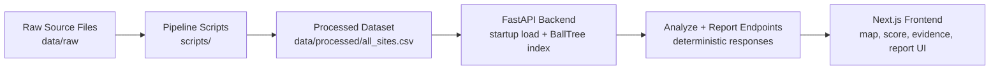

## Live Link

- https://terris-theta.vercel.app/

---

## 1) Mission

Terris exists to make environmental context inspectable.

- Combine scattered federal site datasets into one normalized geospatial index.
- Provide consistent proximity and density signals with explicit scoring logic.
- Surface evidence and drivers so users can verify what influenced each result.

Terris is a screening tool. It does not measure contaminants, diagnose exposure, or replace official records and local testing.

---

## 2) Features

- Deterministic scoring (`v2`) with no AI dependency in `/analyze`.
- Transparent breakdown by source signal:
  `landfill_proximity`, `military_proximity`, `industrial_density`, `superfund_proximity`.
- Evidence lists per category (nearest records with distances).
- Deterministic `/report` endpoint with structured rationale and cached responses.
- Fast startup indexing with `BallTree` (haversine) and no per-request CSV reads.
- Frontend map workflow with click-to-analyze, geocoding, and heat layers.

---

## 3) How It Works

1. **Data preparation** (`scripts/`) normalizes raw datasets into:
   - `data/processed/landfill.csv`
   - `data/processed/military_base.csv`
   - `data/processed/industrial_frs.csv`
   - `data/processed/superfund_npl.csv`
   - `data/processed/all_sites.csv`
   - Industrial rows are derived from the FRS National Facility file.
2. **Backend startup** loads `all_sites.csv` once and builds category-specific spatial indices.
3. **`POST /analyze`** computes nearest distances and density counts around a point.
4. **Score engine** applies fixed thresholds and clamps total to `0-10`.
5. **Frontend** renders score, band, drivers, and evidence for inspection.

<details>
<summary><strong>Data + startup guarantees</strong></summary>

- Dataset is loaded once at app startup.
- BallTrees are built once per category.
- No per-request CSV reads.
- Output is deterministic for the same input coordinates and dataset.

Reference:
- [`backend/app/data_loader.py`](backend/app/data_loader.py)
- [`backend/app/main.py`](backend/app/main.py)

</details>

---

## 4) Scoring System

### Band Mapping

- `Low`: `0.00 - 3.30`
- `Moderate`: `3.31 - 6.60`
- `High`: `6.61 - 10.00`

<details>
<summary><strong>Inspectable thresholds (scoring v2)</strong></summary>

### Landfill Proximity (`0-3`)
- `< 1.0 mi` → `+3.0`
- `< 3.0 mi` → `+2.0`
- `< 10.0 mi` → `+1.0`

### Military Proximity (`0-3`)
- `< 1.0 mi` → `+3.0`
- `< 5.0 mi` → `+2.0`
- `< 15.0 mi` → `+1.0`

### Industrial Density + Proximity (capped at `6.0`)
- Within `1 mi`:
  - `>= 25` sites → `+2.0`
  - `>= 10` sites → `+1.5`
  - `>= 1` site → `+1.0`
- Within `3 mi`:
  - `>= 200` sites → `+2.0`
  - `>= 75` sites → `+1.5`
  - `>= 10` sites → `+1.0`
- Within `10 mi`:
  - `>= 1500` sites → `+1.5`
  - `>= 600` sites → `+1.0`
  - `>= 200` sites → `+0.5`
- Nearest industrial proximity:
  - `< 0.5 mi` → `+1.0`
  - `< 1.5 mi` → `+0.5`

### Superfund (NPL) Proximity (`0-4`)
- `< 1.0 mi` → `+4.0`
- `< 3.0 mi` → `+3.0`
- `< 10.0 mi` → `+2.0`
- `< 25.0 mi` → `+1.0`

Implementation source:
- [`backend/app/scoring.py`](backend/app/scoring.py)

</details>

---

## 5) Architecture Overview



### Runtime Components

- **Frontend (`frontend/`)**
  - Next.js 14 + TypeScript + Tailwind + Leaflet
  - Map interaction, geocoding, heat overlays, response rendering
- **Backend (`backend/`)**
  - FastAPI + Pydantic + pandas + scikit-learn BallTree
  - Deterministic scoring + report generation
- **Data Pipeline (`scripts/`)**
  - Normalization and export to processed CSV artifacts

<details>
<summary><strong>Repository layout</strong></summary>

```text
.
├── backend/
│   └── app/
├── frontend/
│   ├── app/
│   ├── components/
│   └── lib/
├── data/
│   ├── raw/
│   └── processed/
├── scripts/
└── README.md
```

</details>

---

## 6) API Overview

Base URL (local): `http://localhost:8000`

| Method | Path | Purpose |
|---|---|---|
| `GET` | `/health` | Liveness + dataset/version status |
| `GET` | `/stats` | Dataset counts + startup/load metrics |
| `POST` | `/analyze` | Deterministic scoring + evidence for `{ lat, lon }` |
| `POST` | `/report` | Deterministic structured explanation for `{ lat, lon }` |

### Key Request Model

```json
{
  "lat": 40.7128,
  "lon": -74.0060
}
```

### Key Response Fields (`/analyze`)

- `signals`: nearest distances + density counts
- `score.total`: clamped `0-10`
- `score.breakdown`: category points
- `score.band`: `Low | Moderate | High`
- `score.top_drivers`: ranked text drivers
- `evidence`: nearest records by category

<details>
<summary><strong>cURL quick checks</strong></summary>

```bash
curl -s http://localhost:8000/health
curl -s http://localhost:8000/stats
curl -s -X POST http://localhost:8000/analyze \
  -H "Content-Type: application/json" \
  -d '{"lat":40.7128,"lon":-74.0060}'
```

</details>

---

## 7) Local Development

### Prerequisites

- Python 3
- Node.js 18+

### Backend

```bash
python3 -m venv .venv
source .venv/bin/activate
pip install -r backend/requirements.txt
python -m uvicorn backend.app.main:app --host 0.0.0.0 --port 8000
```

### Frontend

```bash
cd frontend
npm install
cp .env.example .env.local
npm run dev
```

Set `frontend/.env.local`:

```bash
NEXT_PUBLIC_API_BASE_URL=http://localhost:8000
```

### Optional smoke test

```bash
python scripts/smoke_test.py
```
